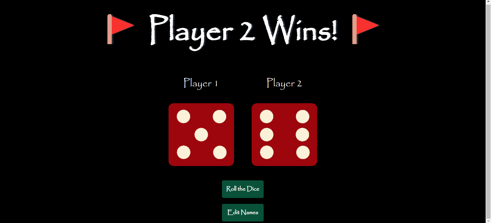
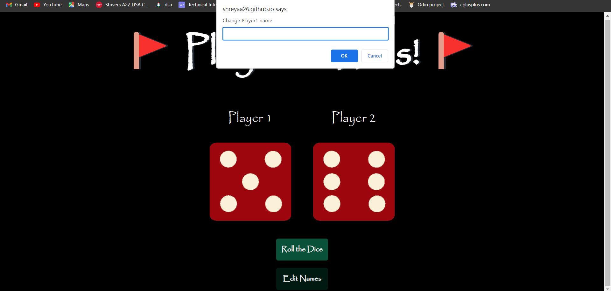

# Roll the Dice Game

Welcome to the Roll the Dice Game! This is a simple web-based game where two players can roll dice and compete to see who gets the higher number. The game provides an interactive way to enjoy a classic dice game virtually.

Home page - 



Edit names feature - 



## Table of Contents

- [Introduction](#introduction)
- [Demo](#demo)
- [Features](#features)
- [Installation](#installation)
- [Usage](#usage)
- [Customization](#customization)
- [Contributing](#contributing)
- [License](#license)
- [Contact](#contact)

## Introduction

This project is a 2D web-based dice game that allows two players to roll dice and determine the winner based on the numbers rolled. Players take turns rolling the dice, and the player with the higher number wins. In case of a tie, the game declares a draw.

## Demo

You can try out the game by visiting the [Roll the Dice Game Demo](https://shreyaa26.github.io/The-Dice-Game).

## Features

- Two players can participate and roll dice.
- Interactive dice rolling animation.
- Display of player names and respective dice.
- Real-time result display.
- Option to edit player names.
- User-friendly interface.

## Installation

To run the project locally, follow these steps:

1. Clone the repository:

   ```bash
   git clone https://github.com/shreyaa26/The-Dice-Game.git

2. Navigate to the project directory:

   ```bash
   cd The-Dice-Game

4. Open the index.html file in your preferred web browser.

## Usage

- Upon opening the game, you'll see two dice, each assigned to a player.
- The default player names are displayed, but you can click the 'Edit Names' button to change them.
- To start the game, click the 'Roll the Dice' button.
- The dice animation will simulate the roll, and the numbers will be displayed.
- The game will determine the winner or declare a draw based on the rolled numbers.
- You can continue rolling the dice by clicking the 'Roll the Dice' button again.

## Customization

You can customize the game by modifying the following aspects:

- Change the styling in the CSS file (styles.css) to match your preferred design.
- Adjust the dice rolling animation speed or add additional animations using JavaScript (script.js).

## Contributing

Contributions are welcome! If you find any issues or have suggestions for improvements, feel free to open an issue or a pull request in this repository.

## License

This project is licensed under the [MIT License](LICENSE).

## Contact

For any questions, suggestions, or feedback, feel free to reach out to me [here](sarohashreya1102@gmail.com).

Connect with me on [GitHub](https://github.com/shreyaa26) and [LinkedIn](https://www.linkedin.com/in/shreya-saroha-a9222922a/).

